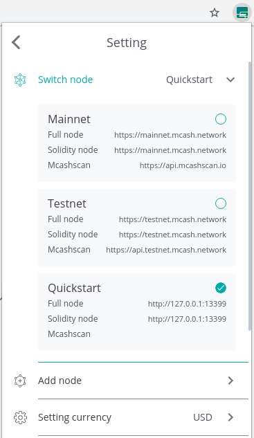

# Quickstart

```bash
# 1. Build
docker build -t mcash/mcashchain:quickstart .

# 2. Run
docker run --name mcash-quickstart -p 13399:13399 -e mnemonic='adjust fluid move domain define behind output blast sand february custom become' mcash/mcashchain:quickstart
```

Full node URL:
http://127.0.0.1:13399/


## Use Wallet in Browser

1. Get extension: https://www.mcashlight.com/


2. Config MCashLight: `Setting -> Add node`

- Node name: Quickstart
- Full node: http://127.0.0.1:13399/
- Solidity node: http://127.0.0.1:13399/





## Development Docs

https://developer.mcash.network/guide/smart-contract/deploy-contract.html#mcashstudio

